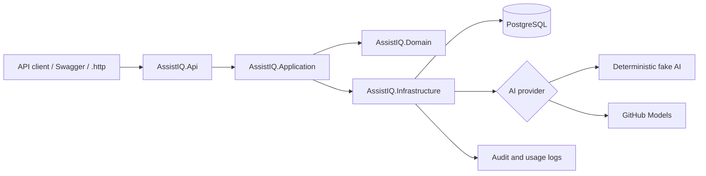

# AssistIQ - SaaS Support Copilot API

[](https://github.com/duygri/AssistIQ/actions/workflows/ci.yml)

AssistIQ is a portfolio backend for a support-team AI copilot. It is built to show more than CRUD: JWT auth, RBAC, EF Core/PostgreSQL, audit logs, usage/cost tracking, pluggable AI providers, and a ticket-to-draft workflow with citations.

## Tech Stack

- ASP.NET Core Web API on .NET 10
- EF Core with PostgreSQL
- JWT authentication and policy-based authorization
- GitHub Models for optional zero-budget AI inference, with a deterministic fake fallback
- xUnit, WebApplicationFactory, PostgreSQL integration tests with Testcontainers
- OpenAPI in development

## Architecture Highlights

- `AssistIQ.Domain`: entity state and business rules such as draft citation gating.
- `AssistIQ.Application`: DTOs, use-case services, stable error codes, and provider-neutral AI boundaries.
- `AssistIQ.Infrastructure`: EF Core persistence, repositories, GitHub Models and fake AI adapters, retrieval/indexing adapters, JWT, audit, usage recording, and seed data.
- `AssistIQ.Api`: controllers, JWT bearer auth, and policy-based authorization.


```mermaid
flowchart LR
    Client[API client / Swagger / .http] --> Api[AssistIQ.Api]
    Api --> App[AssistIQ.Application]
    App --> Domain[AssistIQ.Domain]
    App --> Infra[AssistIQ.Infrastructure]
    Infra --> Db[(PostgreSQL)]
    Infra --> Ai{AI provider}
    Ai --> FakeAi[Deterministic fake AI]
    Ai --> GitHubModels[GitHub Models]
    Infra --> Audit[Audit and usage logs]
```

## V1 Scope

- Admin and Support Agent login
- Admin knowledge document registration and disable workflow
- Support Agent ticket creation
- AI draft generation from ready knowledge documents
- Optional real inference through GitHub Models free quota
- Citation gate: drafts without citations cannot be sent
- Draft editing and sending
- Audit log and usage log admin APIs

Out of scope for V1: paid AI APIs, real file upload, multi-tenant vector stores, billing, mobile app, and real support inbox integrations.

## Local Setup

Requirements:

- .NET SDK 10
- PostgreSQL running locally

Default connection string:

```text
Host=localhost;Port=5432;Database=assistiq;Username=postgres;Password=postgres
```

Apply migrations:

```powershell
dotnet ef database update --project src\AssistIQ.Infrastructure --startup-project src\AssistIQ.Api
```

Run the API:

```powershell
dotnet run --project src\AssistIQ.Api
```

OpenAPI is available in Development at:

```text
/openapi/v1.json
```

## Zero-Budget AI Provider

The API uses the deterministic `Fake` provider by default, so cloning, tests, CI, and the Docker demo never require an AI token or consume model quota.

To generate drafts with a real model at no cost, create a fine-grained GitHub personal access token with the `models: read` permission. Keep paid GitHub Models usage disabled so requests stop instead of generating charges when the free quota is exhausted.

Enable GitHub Models for the current PowerShell session:

```powershell
$env:AI_PROVIDER = "GitHubModels"
$env:GITHUB_MODELS_TOKEN = "your-fine-grained-github-pat"
dotnet run --project src\AssistIQ.Api
```

The default model is `openai/gpt-4.1`. Override it without changing source files:

```powershell
$env:Ai__GitHubModels__Model = "openai/gpt-4.1-mini"
```

For the Docker demo, set the same two environment variables before `docker compose up --build`; Compose passes them to the API container. Tokens belong only in environment variables or a secret manager. Never add a real token to `appsettings`, `.env` committed to Git, or request files.

Return to the offline provider with:

```powershell
$env:AI_PROVIDER = "Fake"
Remove-Item Env:GITHUB_MODELS_TOKEN -ErrorAction SilentlyContinue
```

Successful GitHub Models calls record provider, model, response ID, and token counts. The adapter requests structured JSON and accepts citations only when the returned source ID exists and the quoted text appears in the stored knowledge source. Estimated cost is stored as zero because this project intentionally targets the included free quota.

## Docker Demo Setup

For a one-command demo with PostgreSQL, migrations, and demo users:

```powershell
docker compose up --build
```

Then open:

```text
http://localhost:5255/health
http://localhost:5255/openapi/v1.json
```

The Docker profile sets:

- `ApplyMigrationsOnStartup=true`
- `SeedDemoDataOnStartup=true`
- PostgreSQL at `localhost:5432`

Stop the stack:

```powershell
docker compose down
```

Remove the database volume:

```powershell
docker compose down -v
```

## Demo Users

Demo data seeding is implemented but disabled by default to avoid startup failures when PostgreSQL is not running. Enable it with:

```json
"SeedDemoDataOnStartup": true
```

Seeded accounts:

- Admin: `admin@assistiq.local` / `Admin123!`
- Support Agent: `agent@assistiq.local` / `Agent123!`

These credentials are intentionally public demo seed data. Production secrets and user credentials should be provided through a secret manager or environment variables, not committed configuration.

## Demo Preview


## Core Demo Flow

1. Login as Admin.
2. Register a knowledge document through `POST /api/knowledge-documents`.
3. Login as Support Agent.
4. Create a ticket through `POST /api/tickets`.
5. Generate a draft through `POST /api/tickets/{id}/drafts/generate`.
6. Send the draft through `POST /api/drafts/{id}/send`.
7. Login as Admin and inspect `GET /api/audit-logs` and `GET /api/usage-logs`.

The request collection in `src/AssistIQ.Api/AssistIQ.Api.http` follows this flow.

## Example Requests and Responses

Login returns a JWT and the current user's role:

```http
POST /api/auth/login
Content-Type: application/json

{
  "email": "agent@assistiq.local",
  "password": "Agent123!"
}
```

```json
{
  "token": "eyJhbGciOiJIUzI1NiIs...",
  "user": {
    "id": "11111111-1111-1111-1111-111111111111",
    "email": "agent@assistiq.local",
    "displayName": "Support Agent",
    "role": "SupportAgent"
  }
}
```

Registering a knowledge document makes it available to the deterministic retrieval adapter:

```http
POST /api/knowledge-documents
Authorization: Bearer <admin-jwt>
Content-Type: application/json

{
  "fileName": "billing.md",
  "contentType": "text/markdown",
  "sizeBytes": 512,
  "textContent": "Billing details can be updated from workspace settings."
}
```

```json
{
  "id": "22222222-2222-2222-2222-222222222222",
  "fileName": "billing.md",
  "contentType": "text/markdown",
  "sizeBytes": 512,
  "status": "Ready",
  "providerVectorStoreId": "fake-vector-store",
  "providerFileId": "fake-file-22222222",
  "errorSummary": null,
  "uploadedAt": "2026-07-15T10:00:00Z",
  "indexedAt": "2026-07-15T10:00:00Z",
  "disabledAt": null
}
```

Generating a draft creates a versioned answer with citations. The citation gate is a domain rule: a draft cannot be sent unless it has at least one citation.

```http
POST /api/tickets/33333333-3333-3333-3333-333333333333/drafts/generate
Authorization: Bearer <agent-jwt>
Content-Type: application/json

{
  "instructions": "Use a concise and friendly tone."
}
```

```json
{
  "id": "44444444-4444-4444-4444-444444444444",
  "ticketId": "33333333-3333-3333-3333-333333333333",
  "versionNumber": 1,
  "source": "AiGenerated",
  "status": "Generated",
  "generatedAnswer": "Thanks for reaching out. Based on our support knowledge, how do I update billing details? can be handled using the cited policy.",
  "editedAnswer": null,
  "createdAt": "2026-07-15T10:01:00Z",
  "editedAt": null,
  "sentAt": null,
  "citations": [
    {
      "id": "55555555-5555-5555-5555-555555555555",
      "knowledgeDocumentId": "22222222-2222-2222-2222-222222222222",
      "fileName": "billing.md",
      "providerFileId": "fake-file-22222222",
      "quote": "Relevant support policy excerpt from billing.md.",
      "providerResultId": "fake_result_1",
      "confidence": 0.91
    }
  ]
}
```

If retrieval finds no ready knowledge document, draft generation fails with a stable error code:

```json
{
  "errorCode": "no_ready_knowledge_document",
  "message": "At least one ready knowledge document is required."
}
```

The domain also protects the send operation if a draft reaches it without citations:

```json
{
  "errorCode": "draft_needs_citation_review",
  "message": "Draft cannot be sent without at least one citation."
}
```

## API Surface

| Area | Endpoint | Access |
| --- | --- | --- |
| Auth | `POST /api/auth/login` | Public |
| Auth | `GET /api/auth/me` | Authenticated |
| Knowledge | `GET /api/knowledge-documents` | Admin |
| Knowledge | `POST /api/knowledge-documents` | Admin |
| Knowledge | `POST /api/knowledge-documents/{id}/disable` | Admin |
| Tickets | `POST /api/tickets` | Admin, Support Agent |
| Tickets | `GET /api/tickets` | Admin sees all, Support Agent sees own |
| Tickets | `GET /api/tickets/{id}` | Admin or owner |
| Drafts | `POST /api/tickets/{id}/drafts/generate` | Admin or owner |
| Drafts | `PATCH /api/drafts/{id}` | Admin or owner |
| Drafts | `POST /api/drafts/{id}/send` | Admin or owner |
| Admin Logs | `GET /api/audit-logs` | Admin |
| Admin Logs | `GET /api/usage-logs` | Admin |
| Analytics | `GET /api/admin/stats` | Admin |

## Testing Notes

The test suite uses xUnit, WebApplicationFactory, and Testcontainers. API integration tests start an isolated PostgreSQL 16 container, apply the real EF Core migrations, and seed demo users before each test class. This verifies database behavior, constraints, and provider-specific SQL against the same engine used in deployment.

Docker Engine must be running for the complete test suite:

```powershell
dotnet test AssistIQ.slnx
```

Pure domain and application unit tests remain container-free and can be run without Docker:

```powershell
dotnet test AssistIQ.slnx --filter "FullyQualifiedName!~AssistIQ.Tests.Api"
```

GitHub Actions runs the complete PostgreSQL-backed suite on every push and pull request.

## Request Security

AssistIQ rejects request bodies larger than 256 KiB before controller execution. Actions that bind request bodies explicitly accept `application/json`, and transport DTOs enforce length, email, and numeric boundaries that match the database and application rules.

Invalid model input returns a controlled `validation_failed` response with a correlation ID. Oversized requests return `request_too_large` when the application can produce the response. Neither response echoes submitted field values, credentials, request bodies, or internal exception details.

The body limit is configurable through `RequestSecurity:MaxRequestBodySizeBytes`; keep the default or a lower value for Internet-facing deployments unless a reviewed endpoint requires more capacity.

## Roadmap

- Hosted demo link or short screen recording for recruiters who will not run Docker locally.
- Optional local Ollama provider for fully offline, open-model inference.
- Optional dashboard only if the project is positioned for full-stack roles.

## Verification

```powershell
dotnet build AssistIQ.slnx
dotnet test AssistIQ.slnx
dotnet list AssistIQ.slnx package --vulnerable --include-transitive
```
